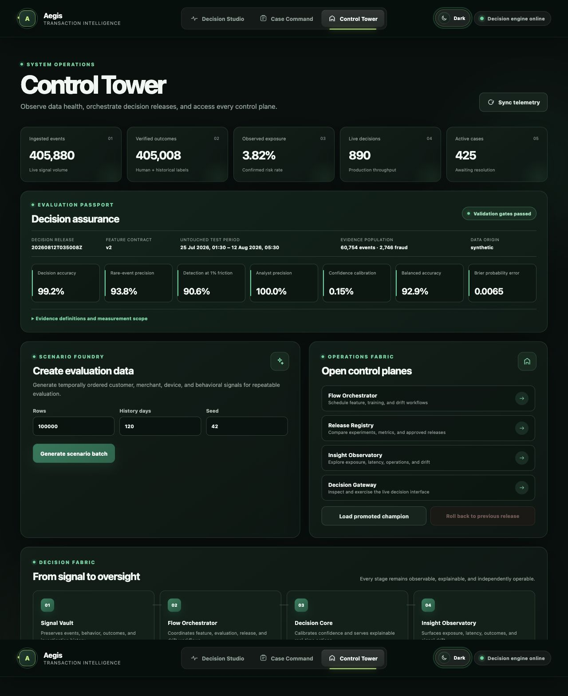
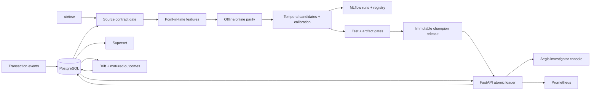
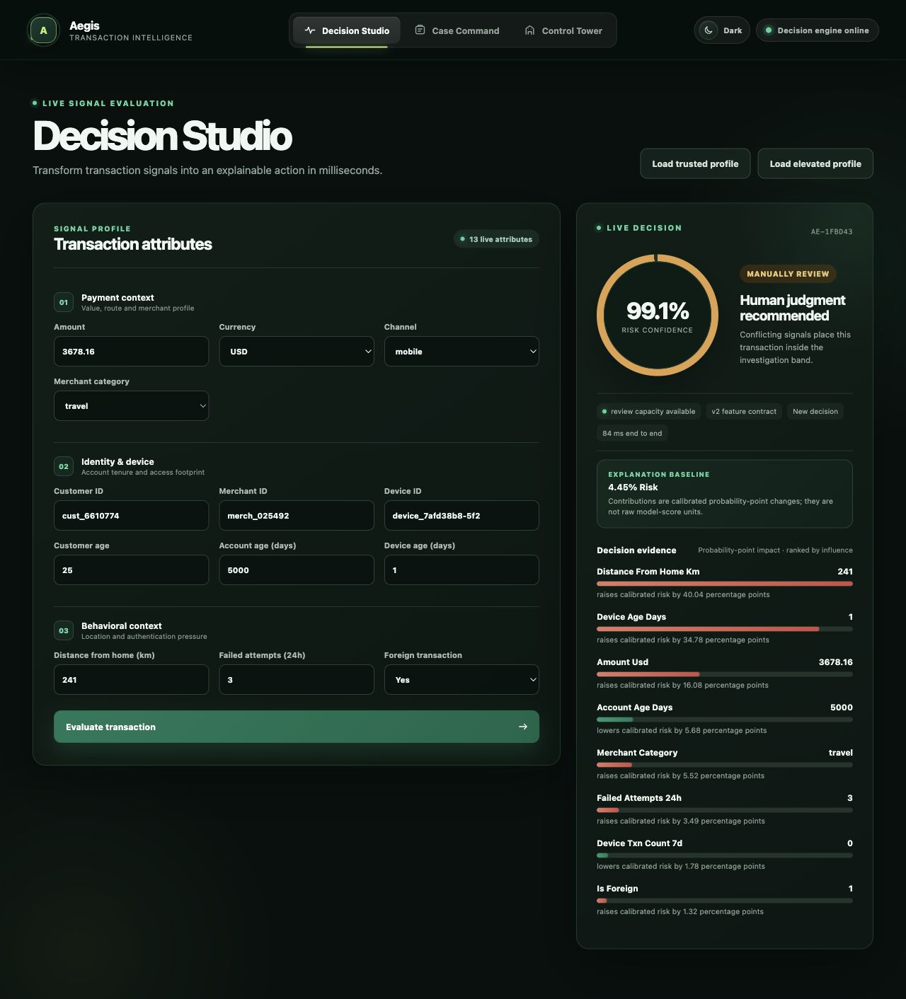
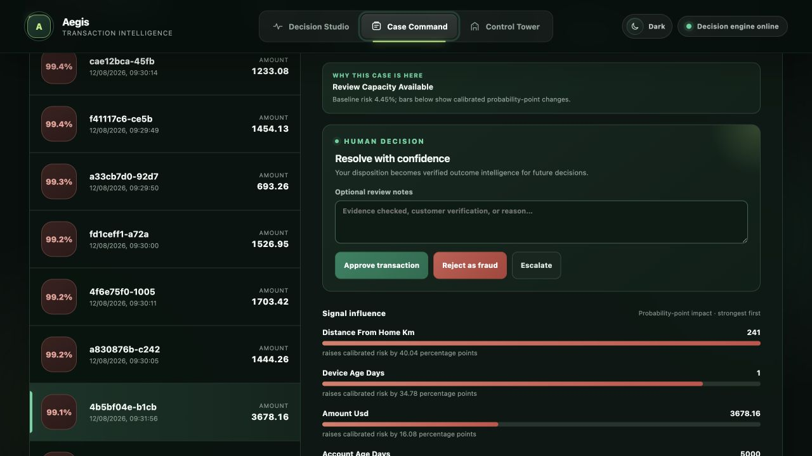

# Aegis · real-time fraud and risk decisioning

Aegis is a self-hosted, end-to-end fraud engineering system: temporal data
generation, point-in-time velocity features, calibrated model selection, governed
promotion, real-time three-way decisions, capacity-bound human review, drift and
matured-label monitoring, and operational dashboards.

Every runtime component is open source: PostgreSQL, Apache Airflow, Python,
scikit-learn, XGBoost, LightGBM, MLflow, FastAPI, SHAP, Evidently, Prometheus,
React, and Apache Superset. No managed cloud or proprietary model service is
required.



## What this repository proves

| Property | Executable evidence |
|---|---|
| Correct | Strict temporal train/calibration/selection/test splits; UTC and currency contracts; equal-time exclusion; offline/PostgreSQL parity; schema fingerprints |
| Functional | One-command Docker workflow; live API, UI, Airflow, MLflow, PostgreSQL, Prometheus, and Superset |
| Measured | Candidate comparison, untouched-test metrics, bootstrap intervals, public benchmark, and Locust latency/throughput report |
| Operational | MLflow challenger/champion aliases, immutable checksummed releases, atomic reload, rollback, bounded review queue, investigator outcomes, and monitoring alerts |
| Credible | Model/data cards and reports distinguish measured synthetic evidence, public-benchmark evidence, simulated money, and production requirements |

## Evidence boundary

The champion result below is **measured on deterministic synthetic data**. It
proves pipeline behavior, not performance at a bank or merchant. The external
OpenML benchmark is reported separately and produces materially different
candidate rankings. Monetary loss avoided is **simulated** under explicit
assumptions. Load-test results are **measured** only for the recorded local Docker
hardware and workload.

See [MODEL_CARD.md](MODEL_CARD.md), [DATA_CARD.md](DATA_CARD.md), and
[docs/LIMITATIONS.md](docs/LIMITATIONS.md) before quoting any result.

## Architecture



The detailed failure, consistency, and hardening design is in
[docs/ARCHITECTURE.md](docs/ARCHITECTURE.md).

## One-command demonstration

Prerequisite: Docker Desktop with Compose.

```bash
./scripts/run_end_to_end_demo.sh
```

From an empty database, the script builds and starts the open-source stack,
generates deterministic labeled history through Airflow, waits for the training
DAG, promotes the gated challenger, atomically reloads FastAPI, and prints every
local URL. It intentionally takes a few minutes because it runs the real workflow.
The demo launches Airflow in manual-only mode to prevent a background schedule
from racing the deterministic run; ordinary `docker compose up` retains the
weekly training and daily monitoring schedules.

Open:

- Investigator console: <http://localhost:3000>
- API documentation: <http://localhost:8000/docs>
- Airflow: <http://localhost:8080> (`admin` / `admin`, local demo only)
- MLflow: <http://localhost:5001>
- Aegis Operations dashboard: <http://localhost:8088/superset/dashboard/aegis-operations/>
  (`admin` / `admin`, local demo only)
- Prometheus: <http://localhost:9090>

The UI is served by nginx. Do not open `ui/index.html` as a `file://` page.

## End-to-end workflow

1. **Scenario Foundry** creates temporally ordered customer, merchant, device,
   and behavior data, or accepts existing PostgreSQL history.
2. **Airflow** validates source quality, builds features from all prior context,
   runs parity checks, trains candidates, validates artifacts, and promotes only a
   passing challenger.
3. **MLflow** stores nested candidate runs, metrics, dataset/schema fingerprints,
   signatures, artifacts, registry versions, and challenger/champion aliases.
4. **FastAPI** loads an immutable checksummed release, warms it, atomically swaps
   the active object, and reports its model/feature versions.
5. **Decision Studio** accepts 13 transaction attributes and returns Approve,
   Manual Review, or Block with a calibrated probability and probability-unit
   SHAP evidence.
6. **Case Command** ranks only capacity-admitted current-release cases and lets an
   investigator approve, reject, or escalate them.
7. **Monitoring** persists predictions, feature distributions, drift evidence,
   matured outcomes, per-release quality snapshots, and review/block/approval
   yield. Drift alerts never auto-promote a model.
8. **Superset** is provisioned automatically with the Aegis PostgreSQL
   connection, six version-aware datasets, six saved evidence tables, and the
   published Aegis Operations dashboard. No manual dataset wiring is required.





## Point-in-time feature contract

The model uses base transaction context plus customer and device velocities over
1 hour, 1 day, and 7 days. Every window is
`[event_time - window, event_time)`: the current event, future events, and
equal-timestamp peers are excluded.

All timestamps must be timezone-aware and normalize to UTC. Monetary aggregation
uses versioned `amount_usd` conversion before rolling. Unlabeled recent events
remain in history so they affect later velocity, but only matured labeled events
become training targets. The current contract is `v2`; its ordered fields,
windows, and currency-rate version are SHA-256 fingerprinted.

The acceptance test is executable:

```text
The same historical transaction produces identical offline and PostgreSQL features.
```

## Measured champion evidence

Release `20260812T041508Z`, feature contract `v2`, dataset SHA-256
`936a98352d2526b00b3f1c99da15341f82686136094eb627c5195a94815fd364`.

Candidate selection used a later temporal validation period; test data was not
opened until a candidate and thresholds were fixed.

| Candidate | Validation accuracy | PR-AUC | Recall @ 1% FPR | Precision@500 | Brier |
|---|---:|---:|---:|---:|---:|
| Logistic baseline | 97.97% | 0.7809 | 70.00% | 98.20% | 0.0168 |
| Anomaly baseline | 95.63% | 0.2019 | 8.34% | 28.00% | 0.0387 |
| Boosted candidate A | 99.11% | 0.9161 | 88.06% | 100.00% | 0.0078 |
| Boosted candidate B · selected | 99.13% | 0.9208 | 88.63% | 100.00% | 0.0075 |

Untouched test period: **2026-07-24 20:00:27 UTC through 2026-08-12
00:00:02 UTC**, **60,754 events**, **2,746 fraud events**.

| Untouched-test metric | Measured result |
|---|---:|
| Accuracy | **99.24%** |
| Balanced accuracy | 92.92% |
| PR-AUC / average precision | **0.9383** |
| Recall at 1% FPR | **90.57%** |
| Precision@500 | **100.00%** |
| Brier score | 0.0065 |
| Expected calibration error | 0.15% |
| PR-AUC bootstrap 95% interval | 0.9303–0.9459 |
| Recall@1% FPR bootstrap 95% interval | 89.47%–91.70% |

Calibration reduced Brier score from 0.0117 to 0.0065 and ECE from 2.70% to
0.15% without changing ranking PR-AUC. The learned review threshold is 6.29%, the
block threshold is 99.95%, and measured investigator capacity is 500. On the test
period, 3,333 cases crossed the review boundary and 2,833 were explicitly
suppressed to respect capacity.

The full-velocity ablation improved PR-AUC from 0.9349 to 0.9383 and
Precision@500 from 99.6% to 100.0%. The magnitude is modest and reported as such;
velocity adds measurable ranking value, not a dramatic synthetic uplift.

Durable evidence:

- [reports/model_comparison.html](reports/model_comparison.html)
- [reports/segment_analysis.html](reports/segment_analysis.html)
- [reports/external_benchmark.json](reports/external_benchmark.json)

## Independent public benchmark

The reproducible harness evaluates all four candidate families on OpenML data ID
1597: 284,807 events, 492 fraud events, and an untouched 42,722-row final source
period. The public copy omits the original `Time` field, so the harness preserves
source row order and explicitly does **not** claim a timestamp-based split.

The strongest public-benchmark candidate reached PR-AUC **0.7571** and recall
**80.77%** at 1% FPR. Two candidates generalized poorly. This result is kept
because negative evidence is more credible than hiding it.

## Measured serving evidence

Locust exercised the full endpoint, including PostgreSQL feature lookup,
calibrated prediction, SHAP explanation, idempotent persistence, and capacity
policy.

| Scope | Measured value |
|---|---:|
| Environment | Docker Linux/ARM64, 10 logical CPUs, 7.75 GiB memory |
| PostgreSQL rows at test | 405,879 |
| Concurrent clients / duration | 10 / 30 seconds |
| Recorded decision requests | 818 |
| Failures | 0 |
| Throughput | 28.11 requests/second |
| End-to-end p50 / p95 / p99 | 180 / 270 / 400 ms |
| PostgreSQL feature-query p95 | 21 ms |
| Model + calibrated explanation p95 | 230 ms |

These numbers are not an SLA. They describe one local run and include the
intentionally expensive permutation-SHAP explanation path. Full evidence:
[reports/load_test.html](reports/load_test.html) and
[reports/load_test.json](reports/load_test.json).

Reproduce it with:

```bash
./scripts/run_load_test.sh
```

## Decision and review guarantees

- Probability is calibrated before thresholds are applied.
- SHAP values are calibrated probability deltas; base + all contributions is
  tested to reconstruct the response probability.
- Every prediction stores release, feature contract, checksum, learned
  thresholds, policy reason, correlation ID, and timing components.
- Identical transaction IDs replay the original response; conflicting payloads
  return HTTP 409.
- A PostgreSQL advisory lock enforces the global active-review limit. Higher-risk
  work can displace the lowest-risk case; overflow is explicitly policy-labeled.
- Investigator approve/reject actions attach actual outcomes; escalation does not
  invent a label.

See [docs/DECISION_POLICY.md](docs/DECISION_POLICY.md).

## Operations and rollback

Promotion requires a matching MLflow challenger alias, checksum, feature-schema
fingerprint, passing quality gates, a loadable calibrated artifact, valid
thresholds, and SHAP probability reconstruction. Release bytes are copied to an
immutable version directory before the current pointer is replaced atomically.
The prior pointer remains available for rollback.

Liveness and readiness:

```bash
curl http://localhost:8000/health/live
curl http://localhost:8000/health/ready
```

Non-demo mode requires `AEGIS_API_KEY` and rejects unauthenticated non-health
requests. Demo credentials and secrets in Compose must be replaced before any
shared deployment.

## Verification and CI

The GitHub Actions workflow validates Compose, applies PostgreSQL migrations,
builds the UI/Airflow/API images, and runs Ruff, mypy, pytest, PostgreSQL
integration tests, and Airflow DAG discovery.

Run the same local checks:

```bash
docker compose --profile test build test
docker compose --profile test run --rm test ruff check src tests airflow load_tests
docker compose --profile test run --rm test mypy src/fraud_platform
docker compose --profile test run --rm test pytest -q
docker compose run --rm airflow-webserver airflow dags list-import-errors
```

High-value tests cover deterministic synthetic generation, UTC/window boundaries,
currency normalization, unlabeled-history semantics, offline/online PostgreSQL
parity, temporal training smoke, artifact loading, promotion/rollback,
idempotency, queue resolution, matured monitoring, and Airflow DAG structure.

## Repository map

```text
airflow/dags/                  orchestration and dependency gates
deploy/postgres/              schema and idempotent migrations
deploy/prometheus/            API scrape configuration
deploy/superset/              self-hosted analytics configuration
load_tests/                   real decision-serving workload
src/fraud_platform/data/      deterministic generation and source validation
src/fraud_platform/features/  shared point-in-time feature contract
src/fraud_platform/models/    candidates, evaluation, artifacts, promotion
src/fraud_platform/serving/   API, validation, atomic model manager
src/fraud_platform/monitoring drift, audit logging, matured outcomes
ui/                           React investigator and operations console
reports/                      reproducible measured evidence
tests/                        unit, PostgreSQL, API, lifecycle, and smoke tests
```

## Production boundary

Before real use, add governed real data, lawful-use/privacy/fairness review,
shadow evaluation, decision-owner approval, TLS, SSO/RBAC, OpenBao-managed
secrets, PostgreSQL replication and recovery drills, signed artifacts, pinned
image digests, independent security/model-risk review, and institution-specific
capacity/cost policies.

MIT licensed. See [LICENSE](LICENSE).
