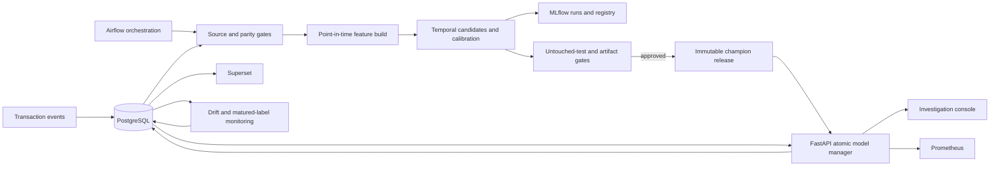

# Aegis architecture

## Runtime topology

All services are self-hosted open-source components. Docker Compose provides a
reproducible local topology; it is not presented as a production deployment.

## Data and feature path

PostgreSQL is the system of record for raw transactions, versioned feature
documents, predictions, release state, review cases, matured outcomes, monitoring
snapshots, and alerts. Offline and online feature paths share currency, UTC,
window, and schema definitions. Both paths query only events strictly earlier
than the transaction timestamp. Feature contract `v2` is fingerprinted from its
ordered feature names, types, windows, and currency-rate version.

Unlabeled production events are valid history context. They influence later
velocity features but are never treated as negative labels. Only matured labeled
rows are written into the training parquet target cohort.

## Model lifecycle

Airflow runs six separately observable tasks:

1. validate the PostgreSQL source contract;
2. build versioned point-in-time features;
3. compare offline features with PostgreSQL online calculations;
4. train and calibrate candidates while logging MLflow child runs;
5. verify checksum, schema, thresholds, model load, and calibrated-probability
   SHAP reconstruction;
6. promote the challenger through MLflow aliases, immutable release bytes,
   atomic pointer replacement, and PostgreSQL release state.

The API loads a complete release into memory, validates and warms it, then swaps a
single reference. In-flight requests retain the old object. A previous pointer is
preserved for rollback. Every prediction stores model version, feature version,
artifact checksum, learned thresholds, and correlation ID.

## Serving and review path

`POST /v1/decision` validates input, enforces transaction idempotency, calculates
prior-only features, scores calibrated risk, applies the three-way policy,
enforces global review capacity under a PostgreSQL advisory lock, and persists an
auditable response snapshot. A repeated transaction ID with identical content
replays the original response; conflicting content receives a structured 409.

Review candidates compete for a bounded active queue. A higher-risk candidate can
displace the lowest-risk open case; overflow cases are explicitly approved with a
capacity-suppression reason. Investigator approval/rejection attaches a verified
outcome and closes the feedback loop.

## Observability and failure behavior

The API exposes liveness, readiness, database readiness, Prometheus metrics, and
feature/model/end-to-end latency histograms. Evidently and deterministic
statistical checks persist input-drift evidence. Matured-label monitoring groups
PR-AUC, fixed-FPR recall, calibration, and decision yield by model/feature version.
Alerts never promote a model automatically.

Superset initialization is code-driven and idempotent. It provisions one Aegis
PostgreSQL connection, datasets over the operations, investigation, performance,
drift, alert, and release relations, six saved charts, and the published
`aegis-operations` dashboard. The dashboard therefore reads the same durable
evidence that drives readiness gates and the investigator workflow; it is not a
static UI mock or a manually configured dependency.

Database operations have connect, pool, and statement timeouts. A model reload
failure leaves the active in-memory release unchanged. Promotion requires both
MLflow registry evidence and a matching local checksum/schema contract.

## Production hardening boundary

For real deployment, add TLS, an identity-aware open-source proxy, OpenBao-managed
secrets, PostgreSQL replication/backups, least-privilege service accounts,
artifact signing, immutable image digests, multiple API workers with coordinated
reloads, network policy, investigator SSO/RBAC, and audited disaster recovery.
